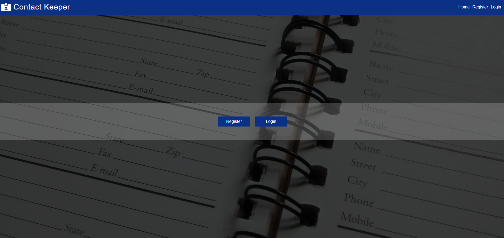

## FRONTEND technologies

## BACKEND technologies

## How to run app

- download app from https://github.com/DariuszOkonski/ContactKeeperApp
- go to folder ContactKeeperApp-main
- should see folders:
  - client
  - server
- and files:
  - .gitignore
  - package.json
  - package-lock.json
  - README.md
- open console (cmd, gitbash)
- install dependencies by running command:

### npm run setup:dep

- than start application by running command:

### npm run start:dev
